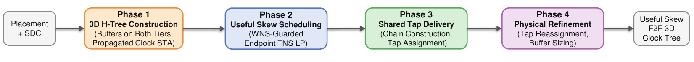
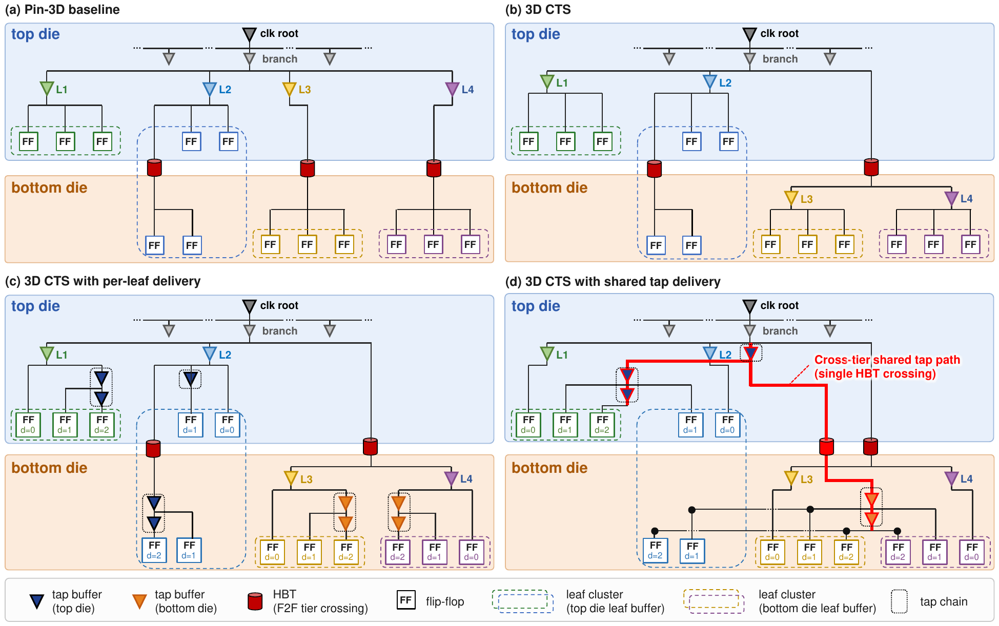
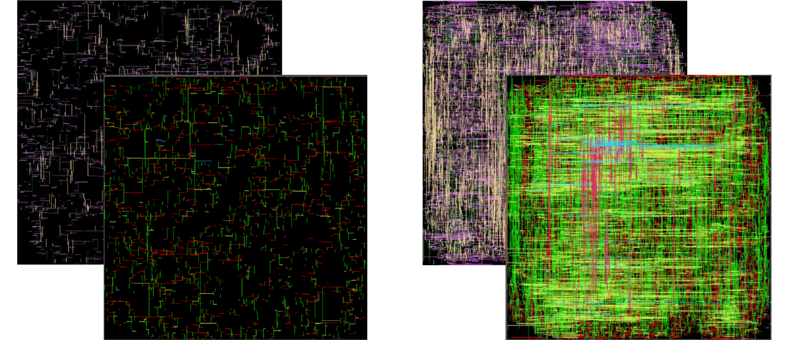

# Shared-Tap Delivery to Close the Realizability Gap in Useful-Skew Clock Tree Synthesis for Face-to-Face 3D ICs

Reference implementation of a useful-skew clock tree synthesis (CTS) flow for
face-to-face (F2F) 3D ICs with hybrid bonding, built on the RosettaStone 2.0
implementation of the Pin-3D F2F physical-design flow.

## Overview

Useful-skew CTS assigns a distinct target clock arrival to each sequential
element. A physical clock tree must *realize* those targets using discrete
buffer stages and shared clock paths. In an F2F 3D clock tree the latency
available to a sink depends on its branch, its tier, the tier's buffer library,
and connections through hybrid-bonding terminals (HBTs). We refer to the
difference between a scheduled arrival and the arrival produced by the
implemented tree as the **realizability gap**. The flow addresses this gap
through shared tap delivery and measures the residual delivery error.

<p align="center"></p>

The flow has four phases:

1. **Balanced 3D H-tree + propagated-clock analysis.** Starting from a placed
   F2F design, a balanced H-tree is built with branches and buffers on both
   tiers. Static timing analysis with propagated clocks supplies base arrivals
   and data-path slacks.
2. **Useful-skew scheduling.** A conventional useful-skew
   scheduler computes a per-sink delay increment, solved as a linear program
   with OR-Tools GLOP. The scheduler uses two optimization passes. The first
   minimizes endpoint WNS, and the second minimizes endpoint TNS subject to a
   5% WNS guard.
3. **Shared tap delivery.** For each clock branch, at most one cascaded tap
   chain is built on each tier. Sinks of the branch that reside on a tier reuse
   the same buffer stages but each selects its own tap depth. A chain placed on
   the tier opposite its branch driver receives the clock through a single HBT.
   This preserves an individual tap depth per sink while sharing buffer stages
   and HBT crossings.
4. **Tap reassignment and one-step buffer downsizing.** Timing analysis after
   construction guides tap reassignment and one-step buffer downsizing before
   routing. Edits are evaluated in batches of ten. A batch is retained only if
   setup and hold TNS and WNS do not worsen. Otherwise, all edits in the batch
   are reverted. Under the placement-based timing used during refinement, the
   retained edits do not worsen setup or hold TNS and WNS relative to the
   Phase 3 tree.

<p align="center"></p>

**Clock structures for F2F 3D ICs.** (a) Pin-3D keeps the tree on one die and
reaches the other die's sinks through HBTs. (b) A 3D clock tree places clock
buffers on both dies, targeting balanced sink arrivals. (c) Per-leaf delivery
uses a cascaded chain for each clock leaf. Sinks with d > 0 tap at their assigned
depths, whereas d = 0 sinks remain on their original leaf nets. Buffer stages are
replicated across the leaves of a branch. (d) Shared tap delivery: sinks with
d > 0 from the same branch and die share a cascaded chain and tap it at their own
respective depths, and a remote group on the far die is fed through one HBT
crossing.

Supporting 3D features (included in the OpenROAD patch): a shared root over both
tiers, and a detailed placer that lets cells at the same location on different
tiers coexist during legalization.

## Results (summary)

Evaluated on five designs (`aes`, `ibex`, `jpeg`, `swerv_wrapper`, `ariane133`)
and two F2F platforms: a homogeneous ASAP7/ASAP7 stack (`asap7_3D`) and a
heterogeneous ASAP7-top / Nangate45-bottom stack (`asap7_nangate45_3D`).

- Relative to Pin-3D, the routed flow reduces the magnitude of setup total
  negative slack in all ten cases (6.4%–97.3%) and improves setup worst negative
  slack in nine.
- Median total cell area increases by 0.7%. Routed wirelength stays within 3.4%
  in all ten cases. Total power differs by at most 3.7% in nine cases, and
  increases by 7.9% for A7/N45 JPEG.
- Compared with per-leaf delivery, which instantiates a separate chain for each
  combination of clock leaf and tier, shared tap delivery reduces the clock cell
  count by 7.5%–49.7%. Hold total negative slack worsens in nine of the ten
  controlled comparisons and is unchanged in one.
- The delivered-request fraction, the delivered increment over the scheduled
  increment at each sink, exceeds 89% in eight cases.

<p align="center"></p>

**Routed clock implementation for A7/A7 JPEG.** Left: clock nets only. Right: all
nets. Each panel is one die. The flow places clock cells and routes the clock on
**both** tiers, whereas Pin-3D drives the top die's sinks from a bottom-only tree
through hybrid bonding.

## Repository layout

```
openroad_3dcts.patch    Source patch for the CTS module + 3D-aware detailed placement
env.sh                  Toolchain paths and environment
Makefile                Flow driver (per-stage make targets)
configs/cts_params.env  Shared default parameters (per-design switches live in run.sh)
scripts_openroad/       OpenROAD Tcl flow scripts (CTS, sizing, routing)
scripts_cadence/        Innovus/Genus scripts (ariane133 route stage only)
util/                   Flow helpers
designs/                RTL and per-design config.mk (public benchmarks)
platforms/              ASAP7 and Nangate45 F2F-merged LEF/lib/fakeram (open PDKs)
test/<platform>/<design>/ord/run.sh   Per-design end-to-end run script
run_benchmarks.sh       Batch runner over all ten design-platform pairs
prebuilt/<platform>/<design>/{4_cts,6_final}.def.gz   Post-CTS and routed layouts, gzipped
open.sh                 View a prebuilt layout in the OpenROAD GUI
figures/                Figures used in this README
```

## Paper → code

Where each part of the method is implemented. These files live in the OpenROAD
source tree once `openroad_3dcts.patch` is applied, not in this repository.

| Paper section | Function / block | File |
|---|---|---|
| Section 3.1, 3D H-Tree Construction | `preSinkClustering()`, `run()`, `createClockSubNets()` | `src/cts/src/HTreeBuilder.cpp` |
| Section 3.2, Useful-Skew Scheduling (two-pass LP) | `solveTns()` | `src/cts/src/CtsSkewLpSolver.cpp` |
| Section 3.3, Shared Tap Delivery | shared-tap block in `createClockSubNets()` | `src/cts/src/HTreeBuilder.cpp` |
| Section 3.3, tap depth from the scheduled increment | depth quantization in `collectFFs` | `src/cts/src/HTreeBuilder.cpp` |
| Section 3.3, delivery groups (branch, tier) | `shBins` binning | `src/cts/src/HTreeBuilder.cpp` |
| Section 3.3, remote group fed through one crossing | `CTS_BRIDGE_PROTOTYPE` block | `src/cts/src/HTreeBuilder.cpp` |
| Section 3.3, one chain per leaf (controlled baseline) | `buildGHSubTree()` | `src/cts/src/HTreeBuilder.cpp` |
| Section 3.4, Physical Refinement (tap reassignment, buffer downsizing, batched acceptance) | `runCtrRefinement()`, Tcl command `cts::run_ctr_refinement` | `src/cts/src/TritonCTS.cpp` |

## Prerequisites

- Linux, GCC 12+ (C++17), CMake 3.16+, Tcl 8.6+, yaml-cpp 0.8+
- OR-Tools 9.15 (built with SCIP) and spdlog 1.15.1
- Boost 1.81
- Yosys (tested with 0.61) for synthesis
- Python 3.8+, standard library only, for inherited flow utilities (not the CTS method)
- Cadence Innovus 21.1, only to reproduce the routed `ariane133` results

## Build

The clock tree synthesis is implemented in the OpenROAD CTS module and released
as a patch against a specific OpenROAD commit.

```bash
# 1. Clone the OpenROAD-Research base and check out the tested commit
git clone https://github.com/ieee-ceda-datc/OpenROAD-Research.git
cd OpenROAD-Research/tools/OpenROAD
git checkout 2c85b9db45c109d48e1f68ef0806746d74e0d6b4

# 2. Apply the 3D-CTS patch (from this repository)
patch -p1 < /path/to/openroad_3dcts.patch

# 3. Build OpenROAD normally (OR-Tools, spdlog, boost, tcl, yaml-cpp available)
cd ../../ # OpenROAD-Research root, or the OpenROAD dir, per your build setup
cmake -S . -B build -DCMAKE_BUILD_TYPE=Release
cmake --build build -j
```

The patch touches only `src/cts` (the useful-skew 3D CTS) and `src/dpl` (the
detailed placer that legalizes cells on both tiers).

## Running

1. Point the toolchain at your builds. The run scripts source `env.sh` themselves,
   so exporting these in the shell you launch from is all that is needed:

   ```bash
   export OPENROAD_EXE=/path/to/OpenROAD-Research/build/bin/openroad
   export YOSYS_EXE=/path/to/yosys
   export STA_EXE=/path/to/OpenROAD-Research/build/src/sta   # power reporting only
   ```

   `env.sh` otherwise falls back to a bare `openroad` / `yosys` on `$PATH`. If an
   executable is unavailable, the script exits with status 127. Set the variables
   above, or add the required tools to your `$PATH`.

2. Run one design end to end (synthesis → 3D placement → CTS → route → final):

   ```bash
   bash test/asap7_3D/aes/ord/run.sh
   ```

3. Or run all ten design-platform pairs:

   ```bash
   ./run_benchmarks.sh
   # subset: PLATFORMS="asap7_3D" DESIGNS="aes ibex" ./run_benchmarks.sh
   ```

Results, logs, and reports are written under `results/`, `logs/`, and
`reports/` inside the repository. The post-CTS timing report is
`reports/<platform>/<design>/openroad/4_cts_timing.rpt`.

## Prebuilt layouts (view without running)

Two layout stages are shipped, gzipped, under `prebuilt/<platform>/<design>/`:
the post-CTS clock tree (`4_cts.def.gz`) and the routed final layout
(`6_final.def.gz`). `open.sh` decompresses one and opens it in the OpenROAD GUI
(an X display, or SSH X-forwarding, is required):

```bash
# routed final layout
bash open.sh asap7_3D aes

# post-CTS clock tree, before routing
bash open.sh asap7_3D aes cts
```

The viewer reads only the DEF and the F2F-merged LEFs named by the design config.
These layouts are provided for inspection. The timing reported in the paper comes
from the full flow with extracted parasitics. Designs: `aes`, `ibex`, `jpeg`,
`swerv_wrapper`, `ariane133`, on `asap7_3D` and `asap7_nangate45_3D`.

## Configuration

`configs/cts_params.env` holds the default parameters shared by every design,
grouped by the flow's four phases.

Phase 1 extracts the register timing graph. The default `EXTRACT_MODE=graph`
uses a fast arc-graph traversal. To use the slower and more accurate OpenSTA
`findPathEnds` extractor instead, leave `EXTRACT_MODE` unset in
`configs/cts_params.env`.

## Notes

- The comparison against Pin-3D holds the placement fixed. Both flows run CTS on
  the same placed design, so the timing difference reflects clock tree synthesis
  and not placement. Placement varies across runs and tools, so running `run.sh`
  from synthesis produces a different placement and shifts the absolute numbers.
  To reproduce the controlled comparison, run this flow's CTS on the placed
  design used for Pin-3D.
- The flow reproduces the CTS-stage results directly. Routing uses standard
  OpenROAD detailed routing (or Innovus for `ariane133`). The final timing
  report is produced by OpenROAD.
